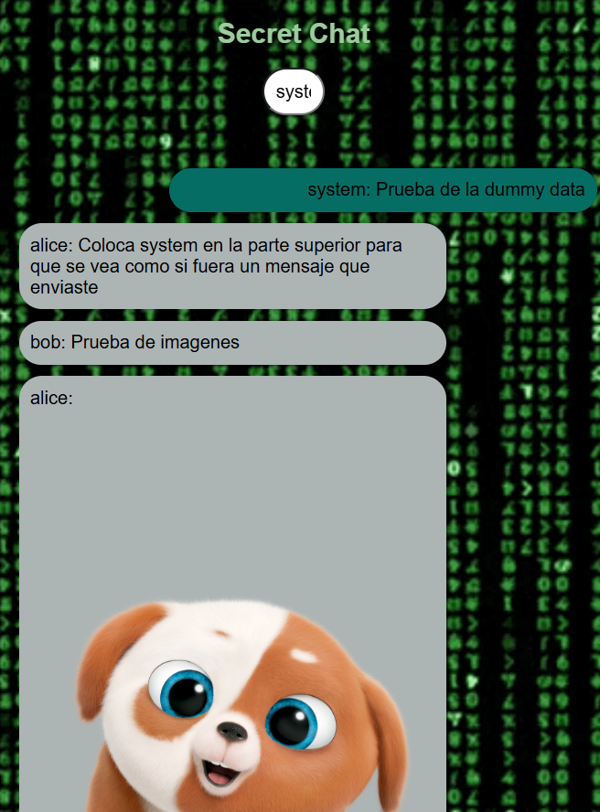

# Secret Chat - Aplicación de Chat Web

## Tecnologías Utilizadas
- HTML5
- JavaScript Vanilla
- CSS (aplicado mediante JavaScript)

## Desarrollador
- Ricardo Godinez

## Descripción
Esta aplicación es un cliente de chat web simple desarrollado únicamente con JavaScript vanilla. Permite a los usuarios intercambiar mensajes de texto e imágenes a través de una interfaz intuitiva y responsive.

## Características principales
- Interfaz de chat con burbujas de mensajes estilizadas
- Actualización automática de mensajes cada 7 segundos
- Modo oscuro/claro con persistencia usando localStorage
- Diseño responsive que se adapta a diferentes tamaños de pantalla
- Uso de fondos animados (GIF)

## Implementación de datos dummy
Debido a posibles problemas de conectividad con el servidor backend, se ha implementado un sistema de datos dummy que permite visualizar la funcionalidad de la aplicación incluso cuando el servidor está caído. Esto asegura que:

1. Se pueda evaluar correctamente la funcionalidad de la aplicación durante revisiones o entregas de tareas.
2. Los usuarios puedan ver cómo funciona la interfaz aunque el servidor no esté disponible.
3. Se muestren ejemplos de los diferentes tipos de contenido (texto e imágenes) que la aplicación puede manejar.

> ⚠️ **Advertencia**: La aplicación intenta conectarse primero al servidor antes de mostrar los datos dummy, por lo que puede haber un retraso de algunos segundos mientras espera la respuesta del API. Si el servidor no responde, después de este tiempo de espera se mostrarán automáticamente los datos dummy.

La función `getDummyChats()` proporciona un conjunto de mensajes de ejemplo que se utilizan automáticamente cuando:
- Ocurre un error en la petición HTTP al servidor
- El servidor responde con un código de error
- Se produce una excepción durante la comunicación con el backend

**Advertencia:** Los datos dummy pueden tardar unos segundos en cargarse.

## Uso
1. Abrir el archivo `index.html` en un navegador web
2. Ingresar un nombre de usuario en el campo correspondiente
3. Escribir un mensaje en el área de texto (máximo 140 caracteres)
4. Presionar el botón "Send" o la tecla Enter para enviar el mensaje

## Conexión al servidor
La aplicación intenta conectarse al servidor backend en la URL `https://chat.nrywhite.lat`. Si el servidor está disponible, se utilizarán los datos reales. En caso contrario, se mostrará un mensaje de alerta y se cargarán los datos dummy automáticamente.

## Notas técnicas
- La aplicación está desarrollada completamente con JavaScript vanilla, sin dependencias externas
- Se utilizan peticiones fetch para la comunicación con el servidor
- La interfaz se genera dinámicamente mediante manipulación del DOM
- Las imágenes incluyen manejo de errores para mostrar la URL como texto cuando no pueden cargarse
